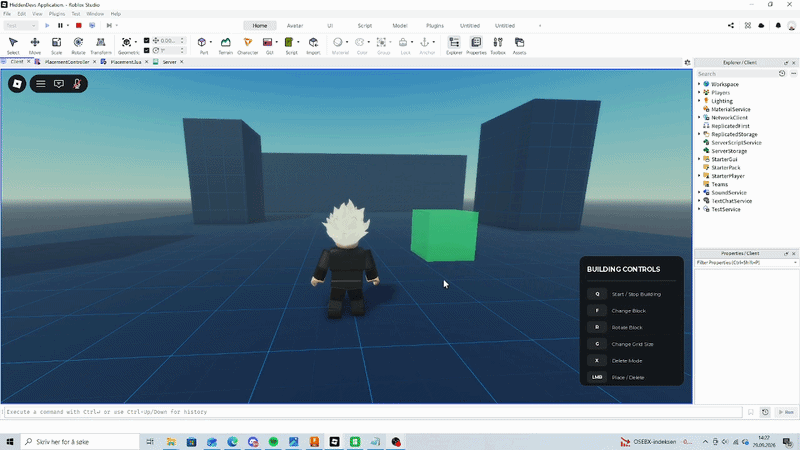

# Roblox Building / Placement System

A client-side building system made in Luau for my HiddenDevs
Luau Scripter application.

## Features

- Grid-based placement
- 90° rotation
- Multiple block templates
- Collision detection
- Placement preview
- Delete mode
- Build range
- Smooth preview movement
- CollectionService-based ownership checks
- CFrame-based placement calculations

## Controls

Q - Start / cancel placement
F - Cycle blocks
R - Rotate
G - Change grid size
X - Toggle delete mode
Left Click - Place / delete

## Demo

## Structure

PlacementController.luau contains the main placement system,
including raycasting, CFrame calculations, grid snapping,
collision validation, preview handling and deletion.

Placement.luau is the small startup script that requires
the controller.

## Dependency

Trove by Stephen Leitnick / Sleitnick RbxUtil is used for
connection and instance lifetime management.

## This is my third time trying to get this approved.
